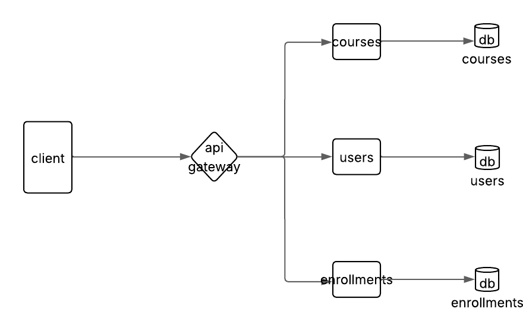

# CourseManager

Sistema de gerenciamento de cursos desenvolvido com arquitetura de microsserviços usando NestJS, PostgreSQL e Docker.

## 📋 Índice

- [Visão Geral](#visão-geral)
- [Arquitetura](#arquitetura)
- [Tecnologias](#tecnologias)
- [Estrutura do Projeto](#estrutura-do-projeto)
- [Pré-requisitos](#pré-requisitos)
- [Instalação e Execução](#instalação-e-execução)
- [API Endpoints](#api-endpoints)
- [Banco de Dados](#banco-de-dados)
- [Desenvolvimento](#desenvolvimento)
- [CI (Integração Contínua)](#ci-integração-contínua)
- [Exemplos de Uso](#exemplos-de-uso)
- [Contribuição](#contribuição)

## 🎯 Visão Geral

O CourseManager é uma plataforma de gerenciamento de cursos que permite:

- **Gestão de Usuários**: Cadastro e gerenciamento de estudantes e professores
- **Gestão de Cursos**: Criação e administração de cursos
- **Matrículas**: Sistema de inscrição de estudantes em cursos
- **API Gateway**: Roteamento centralizado para todos os serviços


## 🏗️ Arquitetura  

O projeto adota uma arquitetura baseada em microsserviços, organizada da seguinte forma:  

- **API Gateway (Nginx)**  
  - Responsável por centralizar o tráfego de requisições e expor a aplicação externamente na porta 80.  
  - Redireciona as chamadas para os respectivos serviços internos.  

- **Users Service**  
  - Porta interna: 3003*
  - Responsável por gerenciar informações de usuários.  
  - Conecta-se ao banco de dados Users DB na porta 5434.  

- **Courses Service**  
  - Porta interna: 3001  
  - Responsável pelo gerenciamento de cursos.  
  - Conecta-se ao banco de dados Courses DB na porta 5432.  

- **Enrollments Service**  
  - Porta interna: 3002
  - Responsável pelo gerenciamento das matrículas.  
  - Conecta-se ao banco de dados Enrollments DB na porta 5433.  

Cada microsserviço possui seu próprio banco de dados, garantindo independência e isolamento de dados.  

### 📊 Diagrama da Arquitetura  



> **Legenda:** Cada bloco (`courses`, `users`, `enrollments`) no diagrama representa um *service* dentro da arquitetura.

## 🛠️ Tecnologias

### Backend
- **NestJS** - Framework Node.js para aplicações escaláveis
- **TypeScript** - Linguagem de programação tipada
- **Prisma** - ORM para banco de dados
- **PostgreSQL** - Banco de dados relacional
- **Docker** - Containerização
- **Nginx** - API Gateway e proxy reverso

### Ferramentas de Desenvolvimento
- **ESLint** - Linting de código
- **Prettier** - Formatação de código
- **Jest** - Framework de testes
- **Docker Compose** - Orquestração de containers

## 📁 Estrutura do Projeto

```
CourseManager/
├── docker-compose.yml          # Configuração dos containers
├── nginx/
│   └── nginx.conf             # Configuração do API Gateway
└── services/
    ├── users/                 # Serviço de usuários
    │   ├── src/
    │   │   ├── controllers/
    │   │   ├── services/
    │   │   ├── dto/
    │   │   └── prisma/
    │   ├── prisma/
    │   │   └── schema.prisma
    │   └── package.json
    ├── courses/               # Serviço de cursos
    │   ├── src/
    │   │   ├── controllers/
    │   │   ├── services/
    │   │   ├── dtos/
    │   │   └── prisma/
    │   ├── prisma/
    │   │   └── schema.prisma
    │   └── package.json
    └── enrollments/           # Serviço de matrículas
        ├── src/
        │   ├── controllers/
        │   ├── services/
        │   ├── dtos/
        │   └── prisma/
        ├── prisma/
        │   └── schema.prisma
        └── package.json
```

## 📋 Pré-requisitos

- **Docker** (versão 20.10 ou superior)
- **Docker Compose** (versão 2.0 ou superior)
- **Node.js** (versão 18 ou superior) - para desenvolvimento local
- **npm** ou **yarn** - gerenciador de pacotes

## 🚀 Instalação e Execução

### 1. Clone o repositório
```bash
git clone https://github.com/Mateus003/CourseManager.git
cd CourseManager
```

### 2. Execute com Docker Compose
```bash
# Iniciar todos os serviços
docker-compose up -d

# Verificar status dos containers
docker-compose ps

# Ver logs dos serviços
docker-compose logs -f
```

### 3. Acesse a aplicação
- **API Gateway**: http://localhost:80
- **Banco de Dados Users**: localhost:5434
- **Banco de Dados Courses**: localhost:5432
- **Banco de Dados Enrollments**: localhost:5433

## 🔌 API Endpoints

### Users Service (`/users/`)

| Método | Endpoint | Descrição |
|--------|----------|-----------|
| POST | `/users/` | Criar novo usuário |
| GET | `/users/` | Listar todos os usuários |
| GET | `/users/:id` | Buscar usuário por ID |

### Courses Service (`/courses/`)

| Método | Endpoint | Descrição |
|--------|----------|-----------|
| POST | `/courses/` | Criar novo curso |
| GET | `/courses/` | Listar cursos (com filtro por professor) |
| GET | `/courses/:id` | Buscar curso por ID |

### Enrollments Service (`/enrollments/`)

| Método | Endpoint | Descrição |
|--------|----------|-----------|
| POST | `/enrollments/` | Criar nova matrícula |
| GET | `/enrollments/students/:id` | Buscar matrículas por estudante |
| GET | `/enrollments/courses/:id` | Buscar matrículas por curso |

## 🗄️ Banco de Dados

### Schema Users
```prisma
model User {
  id        String   @id @default(uuid())
  name      String
  email     String   @unique
  password  String
  role      Role
  createdAt DateTime @default(now())
}

enum Role {
  STUDENT
  TEACHER
}
```

### Schema Courses
```prisma
model Course {
  id          String   @id @default(uuid())
  titulo      String
  descricao   String
  professorId String   
  criadoEm    DateTime @default(now())
}
```

### Schema Enrollments
```prisma
model Enrollment {
  id        String   @id @default(uuid())
  studentId String
  courseId  String
  date      DateTime @default(now())

  @@unique([studentId, courseId])
}
```

## 💻 Desenvolvimento

### Executar serviços individualmente

```bash
# Executar apenas um serviço específico (com dependências)
docker-compose up users
docker-compose up courses
docker-compose up enrollments

# Executar em modo desenvolvimento (com rebuild)
docker-compose up --build users
```

### Executar serviço isolado (sem dependências)

```bash
# Para debug ou desenvolvimento isolado
docker build -t users-service ./services/users
docker run -p 3003:3003 users-service
```


## 🧪 Testes

```bash
# Testes unitários
npm run test

# Testes em modo watch
npm run test:watch

# Testes com cobertura
npm run test:cov

# Testes e2e
npm run test:e2e
```

## 🐳 Docker

### Comandos Docker

```bash
# Rebuild dos containers
docker-compose build

# Parar todos os serviços
docker-compose down

# Parar e remover volumes
docker-compose down -v

# Ver logs de um serviço específico
docker-compose logs -f users

# Executar comando em um container
docker-compose exec users sh
```

### Variáveis de Ambiente

Os serviços utilizam as seguintes variáveis de ambiente:

- `DATABASE_URL`: URL de conexão com o PostgreSQL
- `PORT`: Porta do serviço (padrão: 3001, 3002, 3003)

## 🔄 CI (Integração Contínua)

O projeto utiliza Integração Contínua (CI) para automatizar o processo de desenvolvimento e garantir qualidade do código:

### Pipeline de CI

- **Build Automático**: Compilação automática das imagens Docker
- **Testes Automatizados**: Execução de testes unitários em todos os serviços
- **Validação de Código**: Verificação automática em pull requests
- **Notificações**: Alertas em caso de falhas no pipeline

### Serviços Testados

- ✅ **Courses Service**: Testes unitários automatizados
- ✅ **Enrollments Service**: Testes unitários automatizados  
- ✅ **Users Service**: Testes unitários automatizados

### Status do Pipeline

[](https://github.com/Mateus003/CourseManager/actions)

## 📝 Exemplos de Uso

```json
{
  "name": "João Silva",
  "email": "joao@email.com",
  "password": "senha123",
  "role": "STUDENT"
}
```

### Criar um curso
```json
{
  "titulo": "JavaScript Avançado",
  "descricao": "Curso completo de JavaScript",
  "professorId": "uuid-do-professor"
}
```

### Matricular estudante em curso
```json
{
  "studentId": "uuid-do-estudante",
  "courseId": "uuid-do-curso"
}
```
